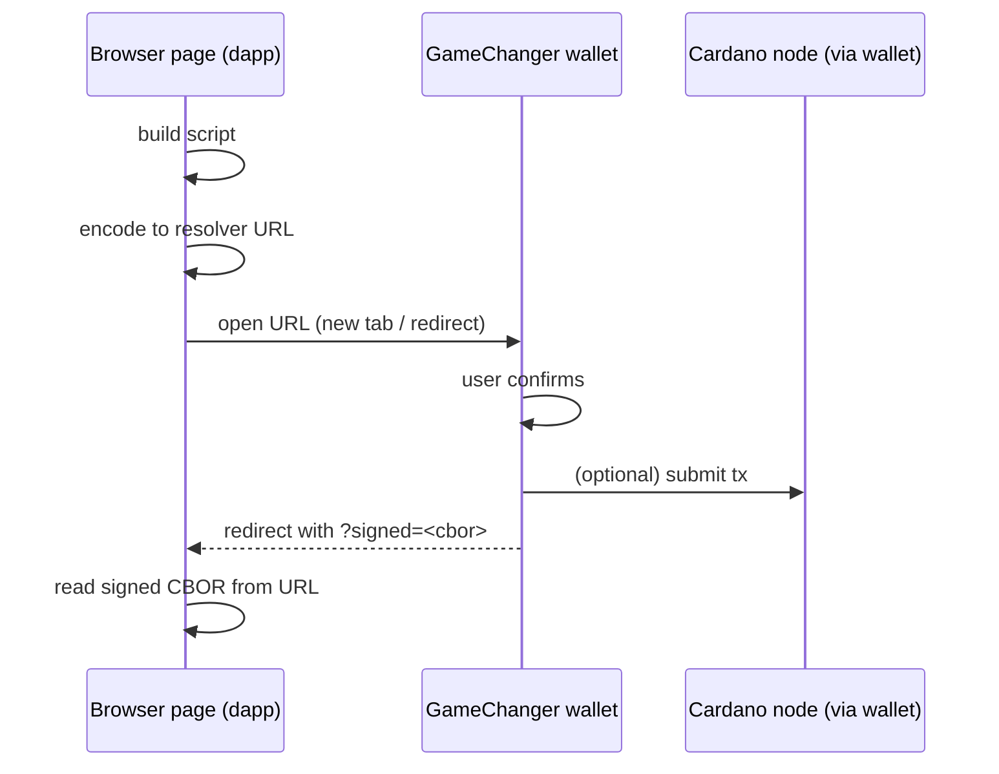
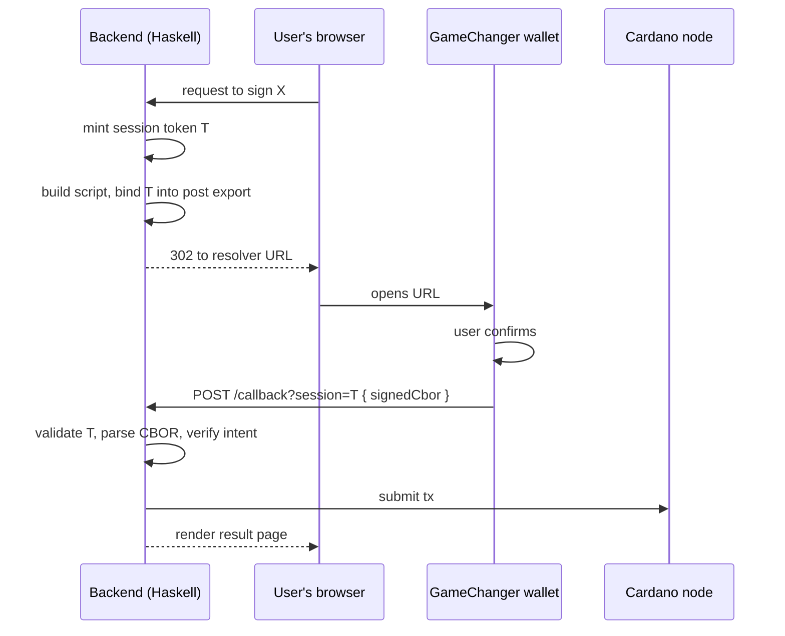
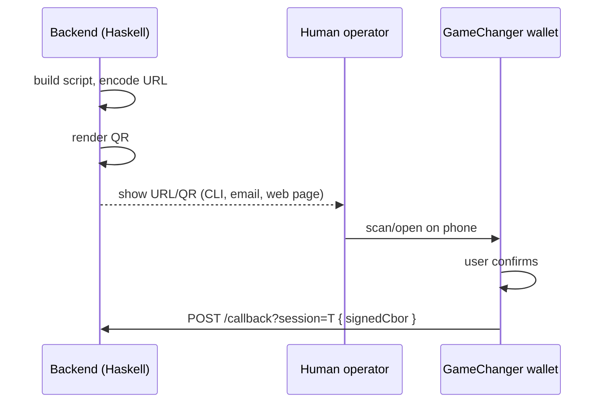

# Integration

Three canonical topologies for building against GameChanger.

## 1. Client-only

A single browser page generates the script, opens the resolver URL,
receives the result via a `return` export in its own URL, and uses the
result locally.

- No backend.
- Haskell is not in the hot path.
- The Haskell library may still be used to *author* the script and
  URL, if the front-end is WASM / Haskell-generated.

## 2. Client + backend callback

A backend issues the resolver URL (with a `post` export pointing at a
backend endpoint), the user's browser opens it, the wallet POSTs the
signed result to the backend.

**This is the topology the Haskell library primarily targets.**

Key responsibilities of the backend:

- Mint per-request session tokens with short TTLs.
- Bind each session to the resolver URL it issued.
- Validate the session on callback; reject replays.
- Parse the returned CBOR strictly; reject anything that is not the
  transaction the backend intended to sign.
- Submit the signed transaction through existing node-client paths.

## 3. Backend-only issuer

A backend produces resolver URLs or QR codes for humans. The human
opens the URL on whatever device holds their wallet. The result comes
back via `post` to the same backend (or via the user pasting a
downloaded/copied result back into a form).

Useful for operational flows — MPFS fee adjustments, MOOG oracle
whitelisting, one-off admin signatures — where the person signing is
not the same person running the backend, and where a full web UI is
overkill.

## Choosing between them

| Question | Client-only | Client+callback | Backend-only |
|---|---|---|---|
| Is there a Haskell backend involved at all? | No | Yes | Yes |
| Does the signer use the same device as the issuer? | Yes | Yes | Not required |
| Is the signing operator the end-user? | Yes | Yes | Often no |
| Needs a backend-tracked session? | No | Yes | Yes |
| Gives Haskell full control of script content? | Only if front-end is WASM | Yes | Yes |

## What the Haskell library will expose

The eventual API layers, each usable in isolation:

- `GameChanger.Script` — typed script records and JSON codecs.
- `GameChanger.Encoding` — `Script -> Text` (resolver URL) and back.
- `GameChanger.QR` — URL → QR (SVG/PNG).
- `GameChanger.Callback` — typed callback payloads, session
  validation hooks, servant endpoint combinators.
- `GameChanger.CLI` — an executable that drives the whole pipeline
  for manual testing on preprod.

Layered this way, all three topologies compose from the same parts:
topology 1 uses only `Script + Encoding`; topology 2 uses
`Script + Encoding + Callback`; topology 3 adds `QR`.
