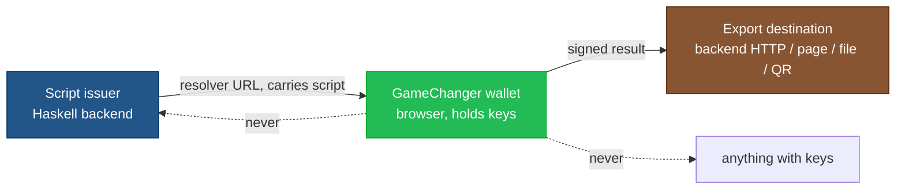

# Security

Threat model, attack surface, and published-audit status for
GameChanger as a protocol and for integrations built with this
library.

!!! warning "Scope"
    This page analyzes the *protocol* and the *integration patterns*
    this repository will adopt. It does **not** analyze the
    GameChanger wallet source or perform a code audit of the wallet.
    It does summarize what is publicly documented and audited about
    the wallet itself; absence of a published audit is noted as such.

## Trust model

Three parties. Keys flow only to the wallet.

### Invariants

- **Only the wallet has keys.** No signing happens in Haskell, in the
  browser page, in the callback handler, or anywhere else.
- **The script is public** from the moment it is in a URL. Treat it
  like query-string data: never embed secrets in scripts.
- **The user confirms in the wallet UI.** Any integrity claim about
  "the user signed X" ultimately rests on the user reading the
  wallet's confirmation screen and agreeing.

## In-scope boundaries

1. **Issuer → Wallet.** The resolver URL. In transit over the
   user's machine and network.
2. **Wallet → Destination.** The result channel. For backend
   integrations this is an HTTP POST *from the browser* to a backend
   endpoint.

Anything else (the backend-to-node link, the user's phone, the
wallet's own key storage) is out of scope for the protocol threat
model and must be analyzed separately.

## Attack surface

| # | Attack | Surface | Mitigation |
|---|---|---|---|
| A1 | **Callback spoofing** | Unauthenticated POST of forged "signed" CBOR to the callback endpoint | Per-request session tokens bound to the resolver URL; reject callbacks without a valid token; cryptographically verify the returned CBOR signatures before acting on them |
| A2 | **Resolver URL tampering** | Attacker rewrites the encoded script before the user opens it | User confirms in-wallet; backend only submits CBOR whose intent matches its own record of what it asked to sign |
| A3 | **Signed-tx replay** | Captured signed CBOR is resubmitted later | Session tokens are single-use and short-TTL; backend checks on-chain presence before re-submitting |
| A4 | **Malicious script injection** | A compromised front-end issues a script that drains the user instead of performing the intended operation | For sensitive flows, the backend (not the front-end) is the sole script author; user inspects the wallet's plain-language summary before confirming |
| A5 | **Phishing via crafted resolver URLs** | A lookalike URL convinces the user to sign something unintended | Users confirm in the wallet; out-of-band verification of URL source where high-value; CSP on hosting pages |
| A6 | **Session hijack** | Attacker who captures a session token races the legitimate user | Short TTLs; single-use; bind to request context (IP/UA) if feasible |
| A7 | **CBOR injection** | Malformed or oversize CBOR crashes or misleads the backend parser | Strict typed CBOR parsing with explicit limits; never pass unparsed bytes onward |
| A8 | **TLS downgrade / MITM on callback** | Callback URL is plain HTTP or has weak TLS | Callback URLs are always `https://` in production; strict certificate validation client-side is browser-default |
| A9 | **Session token leakage** | Session token appears in logs, referrers, analytics | Tokens are POST-body only where possible; never in query strings of logged URLs; PII-scrub logging |
| A10 | **Submission race** | Two backends race to submit the same signed tx | Idempotency: backend records "submitted" before calling node; on retry, checks on-chain presence first |

## Hardening checklist (for integrators)

Minimum bar before a production deployment:

- [ ] All callback URLs are HTTPS with valid certs.
- [ ] Each resolver URL carries a unique session token generated
      server-side.
- [ ] Session tokens have a TTL no longer than the wallet's signing
      UX allows (typically minutes).
- [ ] Session tokens are single-use.
- [ ] The callback endpoint verifies the session, then validates the
      returned CBOR's semantic content against the backend's record
      of what was requested — not only signature validity.
- [ ] Backend logs do not include full session tokens in search-able
      form.
- [ ] Backend submission path is idempotent against on-chain state.
- [ ] The wallet's human-readable summary matches the backend's
      intent — verified by a human pair on first deployment.

## Published audits of GameChanger itself

**Last checked:** 2026-04-18. **Status:** to be populated during the
discovery phase.

No audit will be cited here unless a public, archivable source is
found. The following are the search targets:

- GameChanger's own site, docs, and blog.
- IOG and Cardano-Foundation-funded audit publications.
- Third-party security-audit registries (Runtime Verification,
  CertiK, Hacken, Tweag, etc.).
- Security disclosures or bug-bounty summaries.

Update this section with a linked, dated entry for each finding. An
explicit *"no public audit found as of YYYY-MM-DD"* is valid and
preferable to silence.

## This repository's own security posture

Currently zero Haskell code has been written. When code lands:

- All external inputs will be parsed strictly with explicit size
  limits.
- Callback handlers will use servant's type-indexed API so that
  unexpected payload shapes fail at the type boundary, not deep in
  handler logic.
- CBOR parsing will use the same libraries the rest of the Cardano
  Haskell ecosystem uses (cardano-api / cardano-binary), never ad-hoc
  decoders.
- No `IO`-embedded crypto in our code — verification will call into
  audited libraries.

A dedicated `/security-review` pass will be run before tagging the
first release.
